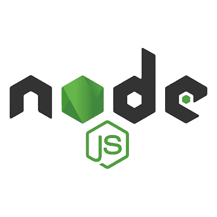

<h1 align="center">Hi 👋, I'm Alberto Ortolani</h1>
<h3 align="center">I'm nice as person and great as Developer</h3>
  
<h3>⭐ Languages and Tools:</h3>

    
    
    
    
    
    
    
    
    
    
    
    
    
    

  
<h3>📌 My proyects</h3>

    <h2 style='font-weight: bold;'>Rocket</h2>
    Website with the aim of facilitating job search among developers and companies in the IT world, managed with 7 other developers using the SCRUM methodology  
    
    
    
    
    
      
    <a target="_blank" href='https://proyecto-final-nu.vercel.app/'>Website</a>

  
    

    <h2 style='font-weight: bold;'>Countries Wiki</h2>
    Country app that included: searches, filtering, ordering and creation form  
    
      
    
      
    
      
    
      
    
      

  
<h3>📱 Contact Me!</h3>

    <a target="_blank" href='https://www.linkedin.com/in/alberto-ortolani-software-developer/'>LinkedIn</a>  
    Email: ortolani.alberto03@gmail.com  

